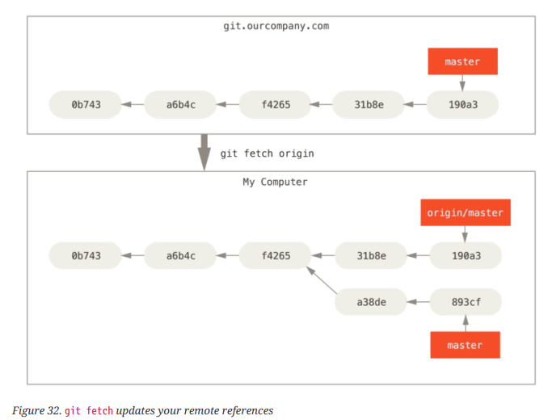
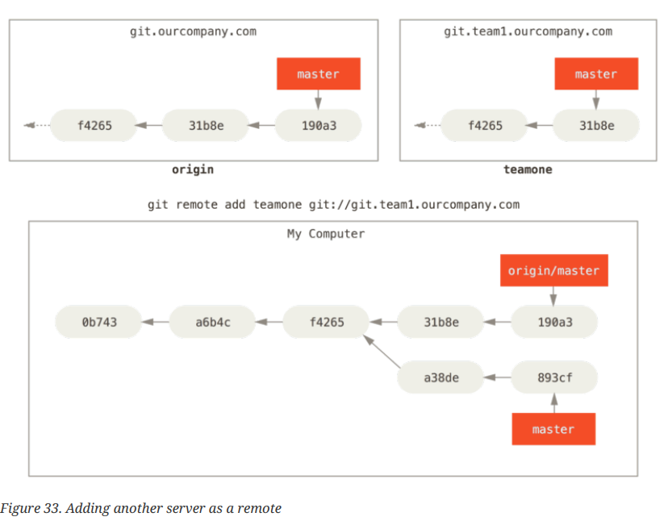
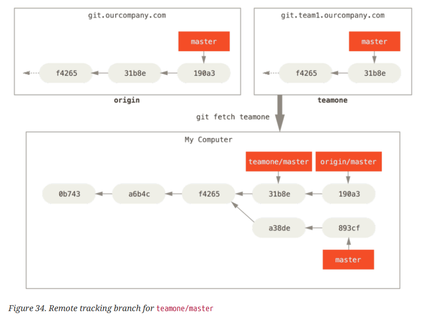
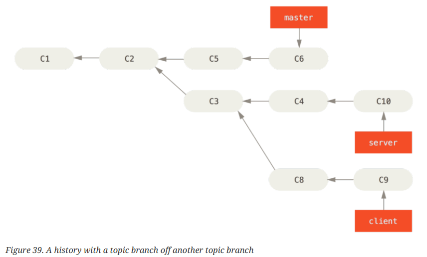
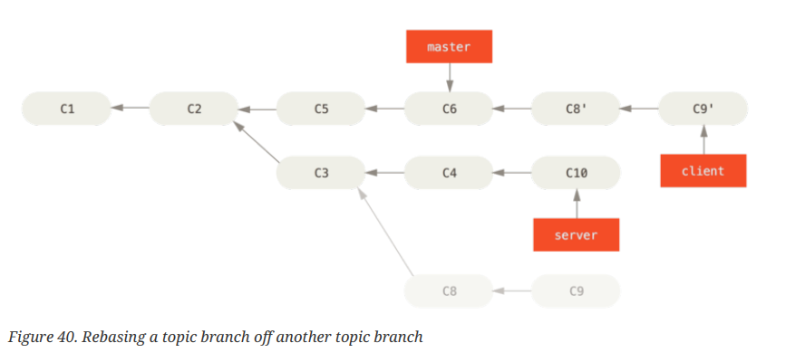
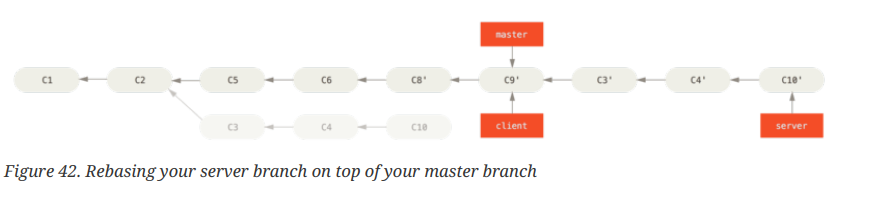
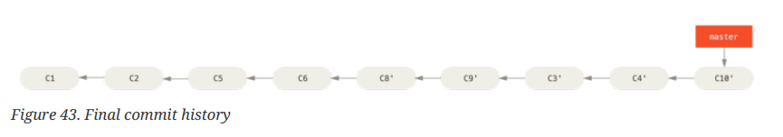

# Git Branching

## Branches in a Nutshell

- Branching means you diverge from the main line of development and continue to do work without messing with that main line.

### Creating a New Branch
- Create a new branch with the `git branch` command:
```bash
$ git branch testing
```
- The `git branch` command only created a new branch — it didn’t switch to that branch.
- How does Git know what branch you’re currently on? It keeps a special pointer called `HEAD`.
- Run the `git log` command to see where the branch pointers are pointing. This option is called `--decorate`
```bash
git log --oneline --decorate
f30ab (HEAD -> master, testing) add feature #32 - ability to add new formats to the central interface
34ac2 Fixed bug #1328 - stack overflow under certain conditions
98ca9 The initial commit of my project
```
- You can see the "master" and "testing" branches that are right there next to the f30ab commit.

### Switching Branches
- To switch to an existing branch, you run the `git checkout` command. Let’s switch to the new `testing` branch:
```bash
$ git checkout testing
```
- Now, let's switch back to master:
```bash
$ git checkout master
```
- **NOTE**: It’s important to note that when you switch branches in Git, files in your working
directory will change. If you switch to an older branch, your working directory will
be reverted to look like it did the last time you committed on that branch. If Git
cannot do it cleanly, it will not let you switch at all.

## Basic Branching and Merging

### Basic Branching
- To create a branch and siwtch to it at the same time run the `git checkout` command with the `-b` switch: It means write `git checkout -b nameofbranch`:
```bash
$ git checkout -b iss53
Switched to a new branch "iss53"
```
- This is the shorthand for:
```bash
$ git branch iss53
$ git checkout iss53
```
- After working on a branch and feels that it's working well and you're done, that means it's time to `merge`. 
- First, you need to leave the branch and go to master (`checkout`) before you can `merge`. You `merge` using the `git merge` command:
```bash
$ git checkout master
$ git merge hotfix
Updating f42c576..3a0874c
Fast-forward
  index.html | 2 ++
  1 file changed, 2 insertions(+)
```
- Delete a branch after merging it with master. It's useless and points to the same place with master.
- You can delete it with the `-d` option to `git branch`:
```bash
$ git branch -d hotfix
Deleted branch hotfix (3a0874c).
```

### Basic Merging
- Suppose you’ve decided that your issue #53 work is complete and ready to be merged into your
`master` branch. In order to do that, you’ll merge your `iss53` branch into `master`:
```bash
$ git checkout master
Switched to branch 'master'
$ git merge iss53
Merge made by the 'recursive' strategy.
index.html | 1 +
1 file changed, 1 insertion(+)
```

### Basic Merge Conflicts
- Occasionally, this process doesn’t go smoothly. If you changed the same part of the same file
differently in the two branches you’re merging together, Git won’t be able to merge them cleanly.
```bash
$ git merge iss53
Auto-merging index.html
CONFLICT (content): Merge conflict in index.html
Automatic merge failed; fix conflicts and then commit the result.
```
- If you want to see which files are unmerged at any point after a merge conflict, you can
run `git status`:
```bash
$ git status
On branch master
You have unmerged paths.
  (fix conflicts and run "git commit")

Unmerged paths:
  (use "git add <file>..." to mark resolution)
    
    both modified: index.html

no changes added to commit (use "git add" and/or "git commit -a")
```
- Anything that has merge conflicts and hasn’t been resolved is listed as unmerged. Git adds standard
conflict-resolution markers to the files that have conflicts, so you can open them manually and
resolve those conflicts. Your file contains a section that looks something like this:
```html
<<<<<<< HEAD:index.html
<div id="footer">contact : email.support@github.com</div>
=======
<div id="footer">
 please contact us at support@github.com
</div>
>>>>>>> iss53:index.html
```
- You have to either choose one side or the other or merge the contents yourself. For
instance, you might resolve this conflict by replacing the entire block with this:
```bash
<div id="footer">
please contact us at email.support@github.com
</div>
```
- If you want to use a graphical tool to resolve these issues, you can run `git mergetool`:
```bash
$ git mergetool
This message is displayed because 'merge.tool' is not configured.
See 'git mergetool --tool-help' or 'git help config' for more details.
'git mergetool' will now attempt to use one of the following tools:
opendiff kdiff3 tkdiff xxdiff meld tortoisemerge gvimdiff diffuse diffmerge ecmerge
p4merge araxis bc3 codecompare vimdiff emerge
Merging:
index.html

Normal merge conflict for 'index.html':
  {local}: modified file
  {remote}: modified file
Hit return to start merge resolution tool (opendiff):
```
- You can run `git status` again to verify that all conflicts have been resolved:
```bash
$ git status
On branch master
All conflicts fixed but you are still merging.
  (use "git commit" to conclude merge)

Changes to be committed:
  
  modified: index.html
```

## Branch Management
- To get a simple listing of your current branches, run the `git branch` command:
```bash
$ git branch
iss53
* master
testing
```
- Notice the `*` character that prefixes the `master` branch: it indicates the branch that you currently have checked out (i.e., the branch that `HEAD` points to).
- To see the last commit on each branch, you can run `git branch -v`:
```bash
$ git branch -v
  iss53 93b412c fix javascript issue
* master 7a98805 Merge branch 'iss53'
  testing 782fd34 add scott to the author list in the readmes
```
- The useful `--merged` and `--no-merged` options can filter this list to branches that you have or have not yet merged into the branch you’re currently on.
- To see which branches are already merged into the branch you’re on, you can run `git branch --merged`:
```bash
$ git branch --merged
iss53
* master
```
- To see all the branches that contain work you haven’t yet merged in, you can run `git branch --no-merged`:
```bash
$ git branch --no-merged
  testing
```
- You can check the merge state of a branch with `master` (or your other branch you want to merge with):
```bash
$ git checkout testing
$ git branch --no-merged master
  topicA
  featureB
```

## Branching Workflows

### Long Running Branches
- Because Git uses a simple three-way merge, merging from one branch into another multiple times
over a long period is generally easy to do. This means you can have several branches that are
always open and that you use for different stages of your development cycle; you can merge
regularly from some of them into others.
- The stable branches are farther down the line in your commit history, and the bleeding-edge branches are farther up the history

- It’s generally easier to think about them as work silos, where sets of commits graduate to a more
stable silo when they’re fully tested


### Topic Branches
- A topic branch is a short-lived branch that you create and use for a single particular feature or related work.
- Consider an example of doing some work (on `master`), branching off for an issue (`iss91`), working on it for a bit, branching off the second branch to try another way of handling the same thing (
`iss91v2`), going back to your `master` branch and working there for a while, and then branching off
there to do some work that you’re not sure is a good idea (`dumbidea` branch). Your commit history
will look something like this:

- Now, let’s say you decide you like the second solution to your issue best (`iss91v2`); and you showed the `dumbidea` branch to your coworkers, and it turns out to be genius. You can throw away the
original `iss91` branch (losing commits `C5` and `C6`) and merge in the other two. Your history then
looks like this:


## Remote Branches
- You can get a full list of remote references explicitly with `git ls-remote [remote]`, or `git remote show [remote]` for remote branches as well as more information.
- To synchronize your work with remote, you run a `git fetch origin` command. This command looks up which server “origin” is, fetches any data from it that you don’t yet have, and updates your local database, moving your origin/master pointer to its new, more up-todate position.

- You can have multiple remote servers and remote branches for those remote projects. 
- Let’s assume you have another internal Git server that is used only for development by one of your sprint teams. This server is at git.team1.ourcompany.com. 
- You can add it as a new remote reference to the project you’re currently working on by running the `git remote add`. Name this remote `teamone`, which will be your shortname for that whole URL.

- Run `git fetch teamone` to fetch everything the remote `teamone` server has that you
don’t have yet. Because that server has a subset of the data your `origin` server has right now, Git
fetches no data but sets a remote-tracking branch called `teamone/master` to point to the commit that
`teamone` has as its `master` branch.


### Pushing
- When you want to share a branch with the world, you need to push it up to a remote that you have
write access to.
- If you have a branch named `serverfix` that you want to work on with others, you can push it up the
same way you pushed your first branch. Run `git push <remote> <branch>`:
```bash
$ git push origin serverfix
Counting objects: 24, done.
Delta compression using up to 8 threads.
Compressing objects: 100% (15/15), done.
Writing objects: 100% (24/24), 1.91 KiB | 0 bytes/s, done.
Total 24 (delta 2), reused 0 (delta 0)
To https://github.com/schacon/simplegit
  * [new branch] serverfix -> serverfix
```
- **NOTE**: If you’re using an HTTPS URL to push over, the Git server will ask you for your username and password for authentication. By default it will prompt you on the terminal for this information so the server can tell if you’re allowed to push.
- **NOTE**: if you don’t want to type it every single time you push, you can set up a “credential cache”. The simplest is just to keep it in memory for a few minutes, which you can
easily set up by running `git config --global credential.helper cache`.
- The next time one of your collaborators fetches from the server, they will get a reference to where
the server’s version of `serverfix` is under the remote branch `origin/serverfix`:
```bash
$ git fetch origin
remote: Counting objects: 7, done.
remote: Compressing objects: 100% (2/2), done.
remote: Total 3 (delta 0), reused 3 (delta 0)
Unpacking objects: 100% (3/3), done.
From https://github.com/schacon/simplegit
 * [new branch] serverfix -> origin/serverfix
```
- Note that you don’t have a new `serverfix` branch — you only have an `origin/serverfix` pointer that you can’t modify.
- To merge this work into your current working branch, you can run `git merge origin/serverfix`. If
you want your own `serverfix` branch that you can work on, you can base it off your remote tracking branch:
```bash
$ git checkout -b serverfix origin/serverfix
Branch serverfix set up to track remote branch serverfix from origin.
Switched to a new branch 'serverfix'
```

### Tracking Branches
- Checking out a local branch from a remote-tracking branch automatically creates what is called a “tracking branch” (and the branch it tracks is called an “upstream branch”).
- You can set up other tracking branches if you wish — ones that track branches on other remotes, or don’t track the `master` branch.
- Running `git checkout -b <branch> <remote>/<branch>`. This is a common enough operation
that Git provides the --track shorthand:
```bash
$ git checkout --track origin/serverfix
Branch serverfix set up to track remote branch serverfix from origin.
Switched to a new branch 'serverfix'
```
- To set up a local branch with a different name than the remote branch, you can easily use the first
version with a different local branch name:
```bash
$ git checkout -b sf origin/serverfix
Branch sf set up to track remote branch serverfix from origin.
Switched to a new branch 'sf'
```
- If you already have a local branch and want to set it to a remote branch you just pulled down, or
want to change the upstream branch you’re tracking, you can use the `-u or --set-upstream-to` option to git branch to explicitly set it at any time.
```bash
$ git branch -u origin/serverfix
Branch serverfix set up to track remote branch serverfix from origin.
```
- If you want to see what tracking branches you have set up, you can use the `-vv` option to `git branch`. This will list out your local branches with more information including what each branch is tracking and if your local branch is ahead, behind or both.
- It’s important to note that these numbers are only since the last time you fetched from each server.
This command does not reach out to the servers, it’s telling you about what it has cached from these
servers locally. If you want totally up to date ahead and behind numbers, you’ll need to fetch from
all your remotes right before running this. You could do that like this:
```bash
$ git fetch --all; git branch -vv
```
### Pulling
- While the `git fetch` command will fetch down all the changes on the server that you don’t have yet,
it will not modify your working directory at all. It will simply get the data for you and let you merge it yourself. 
- However, the `git pull` which is essentially a git fetch immediately followed by a `git merge` in most cases. If you have a tracking branch set up as demonstrated in the last section, either by explicitly setting it or by having it created for you by the clone or checkout commands, `git pull` will look up what server and branch your current branch is tracking, fetch from that server and then try to merge in that remote branch.
- Generally it’s better to simply use the `fetch` and `merge` commands explicitly as the magic of `git pull` can often be confusing.

### Deleting Remote Branches
- You can delete a remote branch using the `--delete` option to `git push`. If you want to
delete your `serverfix` branch from the server, you run the following:
```bash
$ git push origin --delete serverfix
To https://github.com/schacon/simplegit
 - [deleted] serverfix
```

## Rebasing
- In Git, there are two main ways to integrate changes from one branch into another: the `merge` and
the `rebase`.

### The Basic Rebase
- The below images show how the basic merging works. See the below first and second images.

- The second image below shows the experiment branch merged with master:


- **However, there is another way**: you can take the patch of the change that was introduced in `C4` and reapply it on top of `C3`. In Git, this is called rebasing. With the `rebase` command, you can take all the changes that were committed on one branch and replay them on another one:
```bash
$ git checkout experiment
$ git rebase master
First, rewinding head to replay your work on top of it...
Applying: added staged command
```
- The below image shows what happens: the `experiment` branch will now become one step forward than `master`:


- Even if `master` have had more commits since you created the new branch out of it, all the `master` changes will be applied to the new branch, and the branch will be a step forward than `master`:
- At this point, you can go back to the `master` branch and do a fast-forward merge:
```bash
$ git checkout master
$ git merge experiment
```
- **Often, you’ll do this to make sure your commits apply cleanly on a `remote` branch.** Rebasing is what you do when contributing to a remote branch -- perhaps in the project that you don't maintain yourself.
- You can also have your rebase replay on something other than the rebase target branch. Take a
history like A history with a topic branch off another topic branch, for example.
- You branched a topic branch (server) to add some server-side functionality to your project, and made a commit. Then, you branched off that to make the client-side changes (client) and committed a few times. Finally, you went back to your server branch and did a few more commits.

- Suppose you decide that you want to merge your client-side changes into your mainline for a release, but you want to hold off on the server-side changes until it’s tested further. You can take the changes on client that aren’t on server (`C8` and `C9`) and replay them on your `master` branch by
using the `--onto` option of `git rebase`:
```bash
$ git rebase --onto master server client
```
- Here's the result:

- You can now fast-forward your master branch:
```bash
$ git checkout master
$ git merge client
```
- Then the `master` and `client` have the same exact code after moving the `master` forward.

- Now, let's say you want to `rebase` the server.
- Here's what you have to write:
```bash
$ git rebase master server
```
- This replays your `server` work on top of your `master` work

- Then, you can fast-forward the base branch (`master`):
```bash
$ git checkout master
$ git merge server
```
- You can remove the `client` and `server` branches because all the work is integrated and you don’t
need them anymore, leaving your history clean:
```bash
$ git branch -d client
$ git branch -d server
```


### The Perils of Rebasing
- Here's a warning you should always keep in mind when using rebasing:
- **Do not rebase commits that exist outside your repository**
- A member of your team can make a commit and merge it and push it to the public. (Now, let's assume that you've decided to pull that commit to your own repository and even created a new branch that includes that commit).
- If the person who merged the work decides to go back and rebase their work using `git push --force` to overwrite the history on the server. 
- You then fetch from that server, bringing down the new commits.
- It looks more like this. On the git.team1.ourcompany.com, you'll see that some commits are no longer on the server because the team member rebased. Now you've based your work on that. **Learn more with the images on page 91.**

### Rebase When You Rebase
- If you do find yourself in a situation like this, **Git has some further magic that might help you out**. If someone on your team force pushes changes that overwrite work that you’ve based work on, your challenge is to figure out what is yours and what they’ve rewritten.
- Run the `git rebase` teamone/master
- Or you can also simplify this by running a `git pull --rebase`
- **Read below**:
- **If you treat rebasing as a way to clean up and work with commits before you push them, and if you only rebase commits that have never been available publicly, then you’ll be fine. If you rebase commits that have already been pushed publicly, and people may have based work on those commits, then you may be in for some frustrating trouble, and the scorn of your teammates.**
- If you or a partner does find it necessary at some point, make sure everyone knows to run `git pull --rebase` to try to make the pain after it happens a little bit simpler.

### Rebase vs. Merge
- Git is a powerful tool, and allows you to do many things to and with your history, but every team and every project is different. Now that you know how both of these things work, it’s up to
you to decide which one is best for your particular situation.
- **In general the way to get the best of both worlds is to rebase local changes you’ve made but haven’t shared yet before you push them in order to clean up your story, but never rebase anything you’ve pushed somewhere.**
